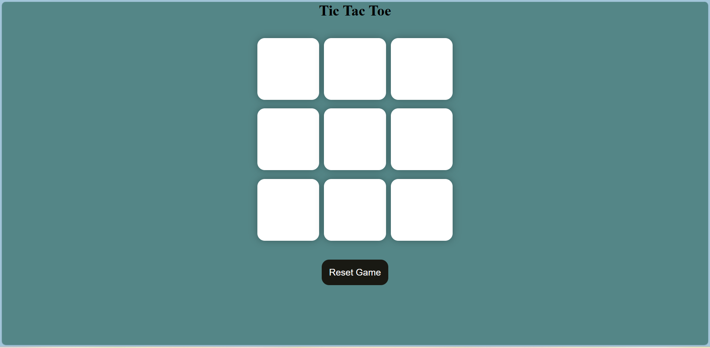
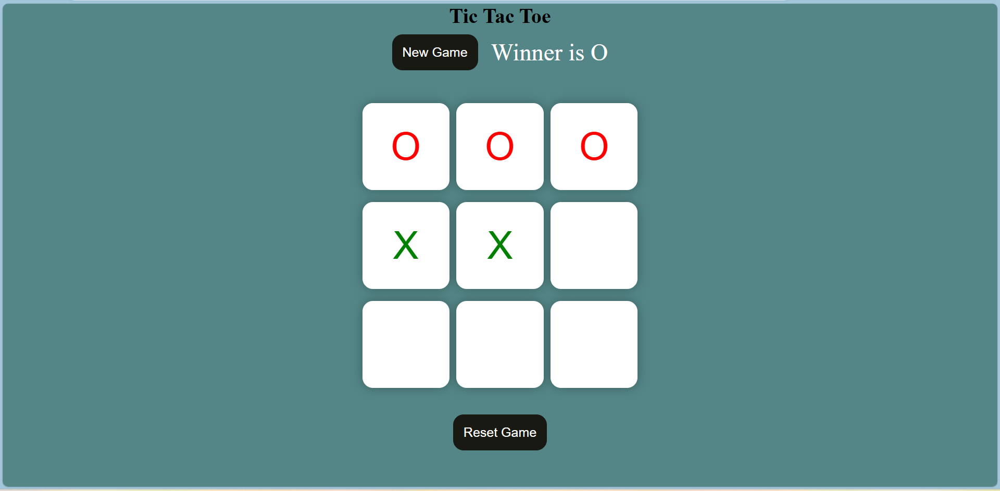
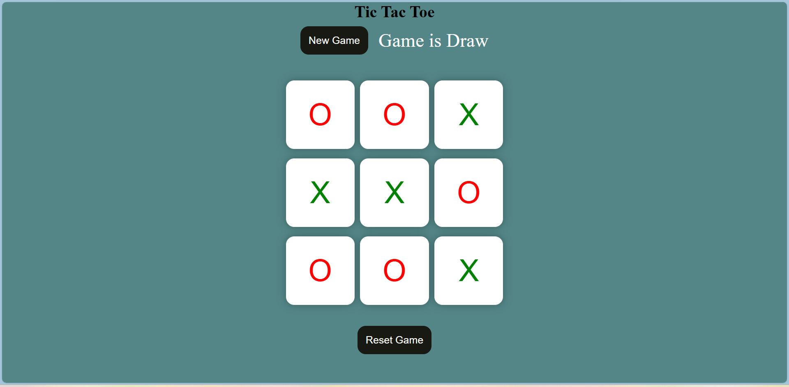

# Tic Tac Toe Game  

A simple web-based **Tic Tac Toe** game that allows two players to compete on a classic 3x3 grid. Built with **HTML**, **CSS**, and **JavaScript**, this project demonstrates essential DOM manipulation and event handling.

## Features  
- Interactive 3x3 grid for gameplay.  
- Two-player mode (Player X and Player O).  
- Highlights the winner or declares a draw.  
- Reset functionality to start a new game.  
- Modern, responsive design with pleasant UI.  

## Technologies Used  
- **HTML5**: Structure of the game.  
- **CSS3**: Styling for an aesthetic look and feel.  
- **JavaScript**: Game logic and interactivity.  

## Installation and Setup  
1. Clone the repository or download the ZIP file.  
   ```bash
   git clone https://github.com/karthi1048/Tic-Tac-Toe.git
2. Navigate to the project directory.  
   ```bash
   cd tic-tac-toe
3. Open the index.html file in your preferred browser.

## Usage  
1. Players take turns clicking on the grid cells to place their mark (X or O).  
2. The game announces the winner once a player completes a winning pattern.  
3. If all cells are filled without a winner, the game declares a draw.  
4. Use the **"Reset Game"** button to clear the board or the **"New Game"** button to start fresh.  

## Winning Patterns  
The game checks the following patterns to declare a winner:  
- Horizontal: Rows 1, 2, or 3.  
- Vertical: Columns 1, 2, or 3.  
- Diagonal: Top-left to bottom-right, or top-right to bottom-left.  

## Screenshots




## Contribution  
Contributions are welcome!  
1. Fork the repository.  
2. Create your feature branch: `git checkout -b feature-name`.  
3. Commit your changes: `git commit -m "Add some feature"`.  
4. Push to the branch: `git push origin feature-name`.  
5. Open a pull request.  

## Acknowledgements  
- Inspired by the timeless game of Tic Tac Toe.  
